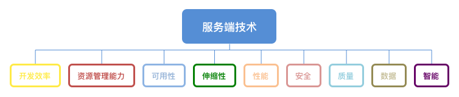

# 服务端软件技术树

自20世纪30年代现代计算机诞生至今，服务端软件技术（本文简称服务端技术）已经发展成为IT领域一大重要分支。大到操作系统，小到仅一行代码的工具，数以亿计的服务端软件运行在无数服务器和各类硬件设备上，支撑着现代人类文明的运转。

为使一个服务端软件从开发到最终交付运行，技术人员除了要实现业务相关的功能外，还要解决一些业务无关的问题，比如性能、效率、质量等。进一步说，所有业务无关问题又都能归类到少数几个问题上，本文称之为“业务无关元问题”，简称`元问题`。举个例子，我们经常遇到的一个业务无关问题是开发成本过高，而成本过高的原因往往是开发效率低下，因此成本并非元问题，而是结果或指标，开发效率才是元问题。事实上，业内对元问题的划分和定义由来已久，参与者众多，包括权威机构（比如ISO/IEC 9126、25010软件质量模型标准）、各企业以及个人，但目前并未形成统一的事实标准。

本文还有一个演绎版本[《服务端技术全栈之九大门派》](https://www.jianshu.com/p/1303d81b7451)，欢迎阅读。

## 服务端技术元问题模型

本文通过对业内主流思路的借鉴，提出一个独特的元问题模型，将现代服务端技术描述成是一棵由9大元问题领域组成的技术树。经过多年发展，每个元问题领域都已沉淀大量成熟软件或技术理论，在日常研发和技术选型前，技术人员应该先弄清楚自己要解决的元问题是什么，再利用或借鉴该元问题领域下的已有软件或技术理论去做研发。

    

 

## 元问题定义与指标
* [定义和指标](元问题定义和指标/定义和指标.md)

## 元问题主要技术
* 开发效率
    * [编程语言](元问题主要技术/开发效率/编程语言.md)
    * [开发框架与微服务](元问题主要技术/开发效率/开发框架与微服务)
	    * [开发框架与微服务总概](元问题主要技术/开发效率/开发框架与微服务/开发框架与微服务总概.md)
	    * [SpringFramework](元问题主要技术/开发效率/开发框架与微服务/SpringFramework.md)
	    * [SpringBoot](元问题主要技术/开发效率/开发框架与微服务/SpringBoot.md)
	    * [SpringCloud](元问题主要技术/开发效率/开发框架与微服务/SpringCloud.md)
    * ServiceMesh服务网格技术
    * Serverless无服务技术
    * 共享技术与中台
    * 扩展性技术
    * 无代码开发
* 资源管理能力
    * 云计算之SaaS与云原生
    * 云计算之PaaS与容器
    * 云计算之IaaS与虚拟化技术
    * 服务治理
    * DevOps与CICD
* 可用性
    * [单一应用可用性](元问题主要技术/可用性/单一应用可用性.md)
    * 整体应用架构可用性
    * 数据层可用性
* 伸缩性
    * 接入层负载均衡
    * 应用层负载均衡
* 性能
    * 高性能模型
    * 异步架构与消息队列
    * 缓存
    * 垃圾回收
    * 边缘计算
    * 硬件使用优化
    * 性能测试
* 安全
    * 区块链
    * 分布式事务
    * 安全编程框架
    * 接入层安全
    * 应用层安全
    * 安全监测
    * 演练与应急
* 质量
    * 全阶段测试
    * 白盒、黑盒、灰盒测试
    * 静态测试和动态测试
    * 测试驱动开发
* 数据
    * 概览
    * 文件系统
    * 数据库之关系型数据库
    * 数据库之NoSQL
    * 数据库之NewSQL
    * 数据库之链式数据库
    * 大数据之批计算
    * 大数据之流计算
    * 大数据之流批混合
    * 大数据之资源管理
    * 数据的一致性设计
    * 数据的扩展性设计
    * 数据预处理
    * 数据应用：OLTP和OLAP
* 智能

## 特定领域技术

上文提过，元问题指的是业务无关的元问题。一旦我们把目光放到某个特定领域里，就会发现九大元问题仍然覆盖了系统大部分方面，而与此同时，也会有不少业务相关的问题需要另外归类和解决。

* [金融](特定领域技术/金融.md)
