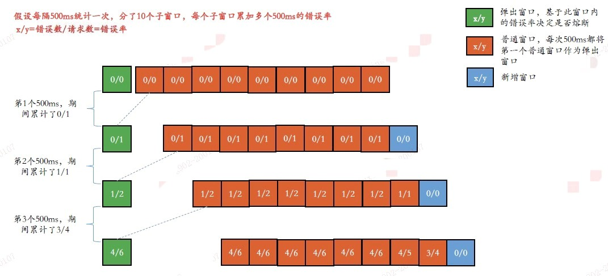

# 应用容错与熔断

对一个应用系统来说，可用性100%永远都是一个梦，但永远不乏追梦者。

导致应用系统不可用的原因五花八门，包括但不限于：

* 流量过载
* 程序主动抛异常
* 程序运行超时
* 程序bug
* 线程池满
* 硬件故障
* 硬件资源耗尽
* 缓存穿透、击穿、雪崩

保证应用系统可用性的思路，一种是尽可能保证系统不出问题，另一种是系统出问题时尽可能保证最低要求的可用。第一种思路只能应对部分原因导致的不可用，比如Serverless技术在流量过载下通过弹性资源分配解决不可用，但不可能适用于任何场景。而第二种思路是更常规的做法，本文称之为应用容错，具体策略包括但不限于：

* 超时重试
* 熔断降级：当请求累计达到某些条件阈值后（比如请求错误率大于某个值），后续请求将不再走正常运行的流程，而是转而执行一个降级流程，从而避免后续请求被夯住导致整个系统雪崩
* 资源隔离/舱壁模式：不同服务使用不同线程池，一个服务耗尽其线程资源后不会影响其他服务
* 流量控制：控制进入系统的流量，将流量控制在应用可承受的范围内，从而避免应用被瞬时的流量高峰冲垮

当前，有很多技术提供了有效的应用容错策略，帮助开发者快速构建高可用的应用系统，Hystrix是其中的标杆。


## Hystrix

Hystrix是Netflix公司开源的一款容错系统，能帮助使用者码出具备强大的容错能力和鲁棒性的程序。Hystrix是豪猪的意思，也是Hystrix的图腾，寓意身披尖刺保护程序获得高可用能力。Spring Cloud集成了很多Netflix项目，其中就包括了Hystrix。Hystrix始于2011年，2018年宣布不再更新，进入长期维护状态，官方推荐使用更强大的`Resilience4J`，尽管如此，Hystrix作为早期容错技术，提供了许多开创性高可用设计，值得我们学习。

Hystrix开源代码库是[https://github.com/Netflix/Hystrix](https://github.com/Netflix/Hystrix)。

### 核心设计

我在[《Hystrix使用入门手册（中文）》](https://github.com/star2478/java-hystrix/wiki/Hystrix%E4%BD%BF%E7%94%A8%E5%85%A5%E9%97%A8%E6%89%8B%E5%86%8C%EF%BC%88%E4%B8%AD%E6%96%87%EF%BC%89)中列举了Hystrix的核心设计。

* 熔断降级：当达到某些条件阈值后（具体见下面的熔断原理），后续请求将不再走正常运行的流程，而是执行降级后的流程，从而避免后续请求被夯住导致整个系统雪崩
* 资源隔离：支持线程池隔离和信号量隔离
	* 线程池隔离：一个服务拥有自己的线程池，用完自己线程也不会影响到其他服务。适用于大部分场景
	* 信号量隔离：一个服务拥有自己的信号量，实际就是一个计时器，每个过来的请求都要先获取信号量，取得才能访问，否则进入降级流程
	* 两者对比：相比起线程池隔离，信号量隔离消耗小，但它只支持同步，比较适合系统间内部访问的场景，因为内部访问响应时间短，同步请求不会导致成功率下降，而在高延迟的外部访问场景下，则应该选择消耗虽大但可以发起异步访问的线程池隔离方案
* 结果cache：支持在同一个context下，自动将前一个请求的结果缓存，后面请求可以直接使用该缓存
* 合并请求：支持将N个请求自动合并为一个请求，这个功能在有网络交互的场景下尤其有用，比如每个请求都要网络访问远程资源，如果把请求合并为一个，将使多次网络交互变成一次，极大节省开销。重要一点，两个请求能自动合并的前提是两者足够“近”，即两者启动执行的间隔时长要足够小，默认为10ms，即超过10ms将不自动合并

### 原理

```Java

// 应用程序要使用Hystrix，需要继承HystrixCommand或HystrixObservableCommand
public class HelloWorldHystrixCommand extends HystrixCommand {  
    private final String name; 
    public HelloWorldHystrixCommand(String name) {   
        super(HystrixCommandGroupKey.Factory.asKey("ExampleGroup"));
        this.name = name; 
    } 
    // 正常运行的流程
    @Override
    protected String run() {
        return "Hello " + name; 
    }
    // 熔断降级后的流程
    @Override
    protected String getFallback() {
        return "Fallback " + name; 
    }
}

public class HelloWorldTest {
	// 构造函数执行
	HelloWorldHystrixCommand command = new HelloWorldHystrixCommand("HLX");
	// execute()执行
	String result = command.execute();
	System.out.println(result);  // 打印出Hello HLX
}

```

上面是使用Hystrix的典型代码示例，可以看到应用程序需要继承Hystrix的类HystrixCommand或HystrixObservableCommand，对此更多的介绍详见我写的[《Hystrix使用入门手册（中文）》](https://github.com/star2478/java-hystrix/wiki/Hystrix%E4%BD%BF%E7%94%A8%E5%85%A5%E9%97%A8%E6%89%8B%E5%86%8C%EF%BC%88%E4%B8%AD%E6%96%87%EF%BC%89)。接下来，我们结合`HelloWorldTest`和下图分析一下Hystrix的工作流程。


<div align="center">
    <a href="../../img/hystrix-flow.png"> </a>
</div>
<br>

* HelloWorldHystrixCommand构造函数执行
	* 初始化`Metrics`：该对象后面会根据HealthCounts保存的数据，决定应用切换为哪个状态（进入熔断、半熔断、关闭熔断）
	* 初始化`HealthCounts`：该对象负责记录累积的请求数、各类错误数、错误率等
* `execute()`执行
	* 如果本次请求可以从cache中获得上一次请求的结果，直接返回
	* 如果熔断器被打开，转去执行降级流程`getFallback()`
	* 如果线程池满或信号量满，转去执行降级流程`getFallback()`，同时HealthCounts增加线程池拒绝次数或信号量拒绝次数
	* 如果能走到这一步，就可以执行正常流程`run()`
	* 如果`run()`执行失败，同时HealthCounts增加失败次数
	* 如果`run()`执行超时，同时HealthCounts增加超时次数
* 熔断
	* 上面execute()执行阶段，HealthCounts统计了请求数和错误数（失败次数+超时次数+线程池拒绝次数+信号量拒绝次数）。如果错误率（错误数/请求数）大于预设的熔断临界值，则熔断器被打开，后面请求执行execute()时将转去执行降级流程getFallback()，一段时间后熔断器自动转为半熔断状态，之后第一个请求将执行执行正常流程run()，如果返回成功则关闭熔断器，后面请求继续走正常流程run()，如果返回失败或超时则继续打开熔断器
	* 这里有一个Hystrix很重要的问题，那就是错误率是如何统计的？一个简单的做法就是设置一个固定的时间区间，比如5s，一个时间区间内发生的所有请求和错误的累加就能得到该区间内的错误率，但这种做法无法有效和及时地反映系统的流量趋势，容易导致熔断器误判，比如一波请求的错误率大于预设的熔断临界值，但不巧的是这波请求分散在一前一后两个时间区间里，这样可能会导致两个时间区间的错误率都小于熔断临界值，结果错过了熔断，使系统面临雪崩的风险。为此，Hystrix采用了滑动窗口算法，将一个时间区间切分成一个个更小粒度的窗口。如下图，时间区间是5s，窗口是500ms
		* 当第1个500ms过去时累计了1个请求（错误率为0/1），所有窗口的错误率都设置为0/1，再在后面新增一个窗口（新增窗口错误率都是0），最后弹出第1个窗口，如果弹出窗口的错误率大于预设的熔断临界值，则熔断器被打开
		* 当第2个500ms过去时累计了1个请求（错误率为1/1），所有窗口都在原来基础上加上1/1，可以看到前8个窗口都变成了1/2，第9个窗口是第1个500ms新增的窗口，由于上一次是0，本次加上1/1后得到1/1，再在后面新增一个窗口（新增窗口错误率都是0），最后弹出第1个窗口，如果弹出窗口的错误率大于预设的熔断临界值，则熔断器被打开
		* 后面的统计以此类推

<div align="center">
    <a href="../../img/hystrix-sliding-window.png"> </a>
</div>
<br>


> Hystrix滑动窗口是基于`RxJava`技术实现的，好处是代码得到极大简化。实际上，Hystrix里大量使用了RxJava。RX(Reactive Extensions)是一种基于观察者模式的响应式编程模型技术，由Microsoft架构师Erik Meijer领导提出，现已推出多种语言库，包括RxJava，RxJS、Rx.NET、RxAndroid等。RxJava是RX的Java版本，尤其适合简化处理数据流的代码，数据流越长简化越明显，其局限是有一定的学习成本，调试比较麻烦。如果有兴趣，可以去[RxJava中文网](https://mcxiaoke.gitbooks.io/rxdocs/content/)进行学习。观察者模式下，会存在`背压`(Backpressure)，即被观察者产生的请求过快过多，观察者无法及时处理。RxJava 1.x对背压问题解决得并不好，RxJava 2.x提供了更灵活处理背压的策略，目前已发展到3.x版本

## 其他技术
Spring Cloud生态中，支持的容错技术包括Hystrix、Resilience4J、Sentinel，它们的区别可见[这里](https://github.com/alibaba/Sentinel/wiki/Guideline:-%E4%BB%8E-Hystrix-%E8%BF%81%E7%A7%BB%E5%88%B0-Sentinel)。Spring Cloud Circuit Breaker集成了以上技术组件，允许开发者自行选择适合自己的。

其中，[Sentinel](https://github.com/alibaba/Sentinel)是阿里巴巴研发的技术，有几点值得关注：

* 插槽链(slot chain)设计：将整个工作流程设计成由一个个插槽组成，每个插槽都有不同的职责，用户也可以定制化自己的插槽进行扩展，提高了系统的扩展性和可读性
* 自适应限流：依赖系统负载load为启动项，因为可能是其他进程导致load下降，不能脱离load做自适应=======
* LeapArray=======