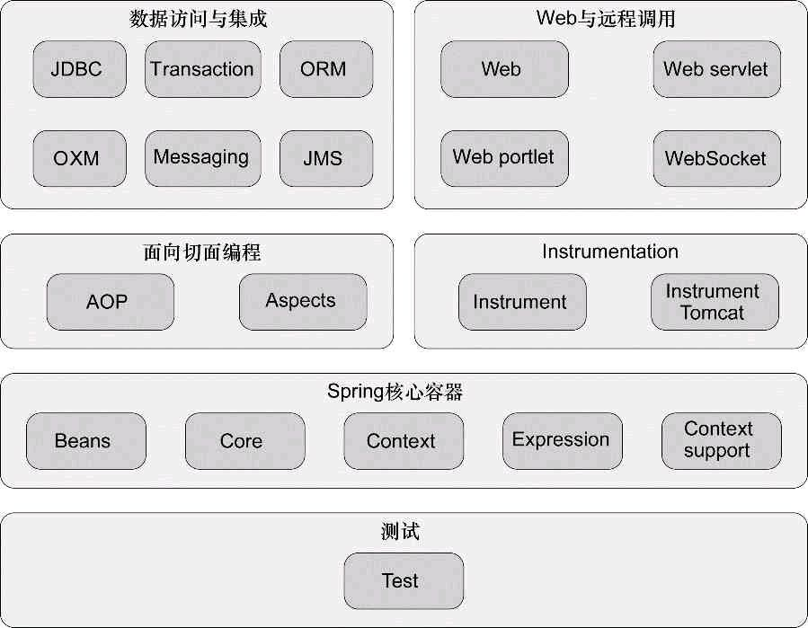
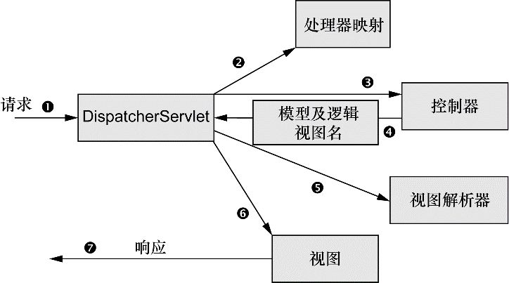

# Spring Framework

<nav>
<a href="#简介">一、简介</a><br/>
<a href="#核心设计">二、核心设计</a><br/>
<a href="#整体架构">三、整体架构</a><br/>
<a href="#IoC原理">四、IoC原理</a><br/>
&nbsp;&nbsp;&nbsp;&nbsp;&nbsp;&nbsp;&nbsp;&nbsp;<a href="#容器初始化">容器初始化</a><br/>
&nbsp;&nbsp;&nbsp;&nbsp;&nbsp;&nbsp;&nbsp;&nbsp;<a href="#bean初始化">bean初始化</a><br/>
&nbsp;&nbsp;&nbsp;&nbsp;&nbsp;&nbsp;&nbsp;&nbsp;<a href="#应用运行期">应用运行期</a><br/>
&nbsp;&nbsp;&nbsp;&nbsp;&nbsp;&nbsp;&nbsp;&nbsp;<a href="#销毁">销毁</a><br/>
<a href="#AOP原理">五、AOP原理</a><br/>
<a href="#Spring-MVC原理">六、Spring MVC原理</a><br/>
<a href="#结语">七、结语</a><br/>
</nav>
<br/>

## 简介

Spring，一个Java领域最重要的开发工具集合，由Java语言编写而成。通过官网[spring.io](https://spring.io)可以看到，Spring已经发展成一个大家族，在这个家族里，最元老级的项目当属`Spring Framework`。Spring Framework包含了Spring最重要的设计哲学，也是几乎所有Spring项目的基石。我们常说的Spring 1到5版本实际就是Spring Framework 1~5。

1998年，Java原母公司sun和IBM推出J2EE `EJB(Enterprise Java Bean)`，但该框架很快由于极其难用被开发者诟病，这给了一个叫Rod Johnson的码农人生逆袭的机会。针对EJB，他在2001年出版`《Expert One-on-One J2EE Design and Development》`，提出更简单优美的开发思路，其中就包括了奠定Spring的部分核心设计，比如依赖注入。紧接着，2004年祭出神作`《Expert One-on-One J2EE Development without EJB》`，同年发布Spring 1.0版本，从此开启统治Java开发框架之路。在Rod带领下，2007年成立了SpringSource公司，经过多年收购和被收购，最终Spring项目被收入Pivotal公司名下，自Spring 4起，到最新的Spring 5，均由Pivotal推出。

Spring Framework官网是[https://spring.io/projects/spring-framework](https://spring.io/projects/spring-framework)，源码托管在[https://github.com/spring-projects/spring-framework](https://github.com/spring-projects/spring-framework)，目前已发展到5.x版本。

## 核心设计

Spring Framework一开始以其简洁周全的设计受到追捧，等到拥有一定市场份额后，才不断增加新的功能，所以其最初的核心设计值得我们来了解。

* 非侵入：它一开始就设计成尽可能减少对应用的侵入。使用Spring核心功能的应用无需继承任何Spring类，通过外置的xml文件就可以使用，而应用一旦不想再使用Spring了，无需修改任何代码。而如果应用使用的是Spring非核心功能，比如JDBC，则还是会有侵入。不过，时至今日Spring已经成为业内的事实标准，它开始鼓励使用核心功能的应用也依赖框架本身，这相当于应用被侵入了，比如开始鼓励使用内置的JavaConfig（纯Java代码或注解）替代外置的XML配置，相反如果不依赖则会导致代码变得复杂难以维护
* `Spring bean`：不管是简单的Java类如`POJO(Plain Old Java Object)`、还是遵循一定规则的Java类如JavaBean，Spring可以将任何形式的Java类转化成可以受到Spring容器管理的实体，这种实体就是Spring bean（后面简称bean）。正是Spring能对Java类实施管理和控制，它才能提供各种原生Java代码无法提供的功能，包括下面的IoC和AOP
* `IoC(Inversion of Control)`：IoC即控制反转，是Spring最著名的设计，指Java对象不由应用本身来创建和控制，而是交给Spring来控制，简单理解就是用一个类时不需要直接new出来，而是通过注解或配置预设好一个类的创建/销毁行为，当Spring启动或运行时自动将类实例化成bean，然后将bean放入一个称为IoC容器的内存空间里进行管理。几乎所有应用都是由多个类相互依赖和协作实现的，IoC的设计可以让相互协作的类保持松耦合，相反，如果一个类要自己控制其所依赖的其他类的创建，软件将变得难以维护和测试，比如要写一个单测，程序里居然要将依赖链路上的所有Java类实例化才能跑起来，可想而知多复杂。应用里的类越多，依赖关系越复杂，IoC实现的松耦合越显威力。严格来说，IoC有两种常见实现方式：
	* `DI(Dependency Injection，依赖注入)`：指类对象被动接受IoC容器将其依赖的对象注入，比如bean初始化过程就用到了DI
	* `DL(Dependency Lookup，依赖查找)`：指类对象主动去IoC容器寻找其依赖对象，比如通过`getBean()`获取依赖对象
* `AOP(Aspect Oriented Programming)`：AOP即面向切面编程，是一种高级的编程模式。AOP并非Spring的专利，有个AOP联盟，Spring是其中的成员。AOP的作用是帮忙开发者更容易将可重用的组件抽离出来，实现组件高内聚，常用的例子就是我们会为每个接口请求前和请求后分别加上监控log，AOP可以通过一个类去定义哪些接口的哪些位置需要加什么样的逻辑，这样一来我们就不需要在每个接口前后都写上两条差不多一样的log了
> IoC实现松耦合，AOP实现高内聚，两者结合就能帮助开发者写出我们常推崇的高内聚低耦合的应用
* 扩展性：Spring提供了很多扩展点，开发者通过实现相关接口就能在整个生命周期的某些阶段进行定制化，比如给bean某个属性设置默认值。虽然大多数应用都不会对开发框架进行扩展改造，而且扩展性导致对应用的侵入，但好处在于不改框架源码就能实现对框架的增强，仍然是一个优秀开发框架应该具备的重要特性。Spring相关扩展点详见下面介绍
* 贴近实际生产的诸多能力：一个开发框架能够成功，前提必须是能直接帮助到实际的生产开发。除了上面几点，Spring还提供了企业开发中诸多常用的功能，包括web、数据库访问等

## 整体架构

<div align="center">
    <a href="../../../img/spring-framework-arch.png"> </a>
</div>

如上图所示，Spring Framework由若干个模块组成。

* 测试：集成Junit等工具库，便于开发者单元测试
* Spring核心容器：包含了所有核心类库，提供两种类型IoC容器`BeanFactory`和`ApplicationContext`，实现对`bean`的管理。还提供了包括`SpEl(Spring Expression Language)`等功能
* 面向切面编程：包括了Spring自己的`AOP`和基于AspectJ框架实现的`AOP`
* Instrumentation：提供对JVM和Web容器的检测
* 数据访问与集成：集成了`JDBC`、`ORM`（如Mybatis，Hibernate）、`事务`、OXM、消息、JMS等
* Web与远程调用：包括了`Spring MVC`、WebSocket等

下面，我们从整体架构里抽出几个重要模块介绍其原理。

## IoC原理
这里介绍的主要是Spring核心容器（或称IoC容器）原理，即Spring从启动到销毁的过程。Spring容器有两大类，分别是`BeanFactory`和`ApplicationContext`，前者过于简单，所以一般都用后者。

下面代码片段是使用ApplicationContext的典型入口程序，通过这段代码来看Spring容器的整个过程，分别是容器初始化、bean初始化、应用运行期、销毁。

```Java

public static void main(String[] args) {
	// 容器初始化、bean初始化：源码里refresh()是关键入口函数
	ApplicationContext context = new ClassPathXmlApplicationContext("helloworld.xml");
	// 应用运行期：通过getBean从Spring容器获得一个bean（对应HelloWorld类），这种属于DL依赖查找
	Demo obj = context.getBean(HelloWorld.class);
}
```

#### 容器初始化
容器初始化阶段的核心流程如下：

* bean定位：从指定路径（classpath、文件系统、web容器、远程等）扫描包，找出定义了bean的资源，比如xml文件，存入Resource对象中，不同Resource实现类可以存放不同位置的bean资源
* bean加载：根据Resource读取出所有类，检查类对应的class是否存在，基于ASM（Java字节码操控框架）解析class并转成IoC内部数据结构`BeanDefinition`对象
	* BeanDefinition记录了一个类的所有bean信息，包括class、scope、lazyinit、beanName等bean属性
* bean注册
	* 将BeanDefinition对象放入BeanDefinitionMap里，key是beanName。如果key重复，则判断是否设置了override
    * 这个map和后面的singletonObjects单例池都是全局数据结构，大部分操作都得使用synchronized防并发
* 按排序顺序执行所有`BeanFactoryPostProcessor`：BeanFactoryPostProcessor是一个接口，实际执行的是该接口的所有实现类相关方法
* 注册和初始化所有`BeanPostProcessor`：BeanPostProcessor也是一个接口，但这里只是注册和初始化它的实现类，真正执行是在下一个阶段——bean初始化
> BeanFactoryPostProcessor和BeanPostProcessor都是Spring的扩展点。前者在容器初始化阶段执行，可以对BeanDefinition进行扩展改造（比如修改bean的scope属性），后者在bean初始化阶段执行，可以对bean实例化过程进行扩展改造（比如修改bean的属性值）。除了这两种扩展点，Spring还提供了一个Aware扩展点，详见下文

#### bean初始化
bean初始化阶段也常称为bean生命周期。一个bean的初始化，不仅仅只是实例化一个Java类那么简单。

如果用的是BeanFactory容器，则所有bean都在应用运行期第一次使用时被初始化。如果使用ApplicationContext容器，情况相对复杂些，要根据bean的scope（作用域）属性和懒加载属性来判断，这里以最常用的scope为单例模式(singleton)且非懒加载为例来说明整个初始化过程。

* 从BeanDefinitionMap依次取出所有bean，循环执行下列操作
* Java类实例化
	* 如果scope为singleton、非懒加载、不是抽象bean，则基于反射对bean对应的Java类进行实例化，执行构造代码块和构造函数
	* 如果bean设置为懒加载(init-lazy)，则在运行期被使用时才初始化
    * Java类实例化后，bean只是半成品，只有成为成品后，bean才可被应用所用
* 属性设置/属性注入
	* 如果bean的某个属性是另一个bean，则跳到另一个bean的初始化过程
	* 如果有A和B两个bean，A有B属性，B有A属性，则形成循环依赖。Spring采用三级缓存来实现循环依赖，即使用三个HashMap来分别存放半成品bean、bean工厂对象、成品bean，整个过程相对复杂，这里不展开讲了
* Aware扩展点执行：与BeanFactoryPostProcessor和BeanPostProcessor一样，Aware也是扩展点。一个bean可以实现了以下三个Aware接口得到相关信息，进而实现相关扩展
	* 如果实现了BeanNameAware，则调用setBeanName()获取beanName
    * 如果实现了BeanFactoryAware，则调用setBeanFactory()获取当前工厂实例的引用
    * 如果实现了ApplicationContextAware，则调用setApplicationContext()获取ApplicationContext容器上下文
* 按排序顺序执行所有BeanPostProcessor实现类的`BeforeInitialization()`
	* 承接上文，我们说过在容器初始化阶段对BeanPostProcessor只是注册和初始化，这里终于执行了
	* BeanPostProcessor很重要，@Autowired和AOP都是BeanPostProcessor各种实现类来完成的
* 执行@PostConstruct注解修饰的方法
* afterPropertiesSet：只要bean实现了InitializingBean接口，就需要实现afterPropertiesSet()，此处就是执行该方法
* init-method：执行init-method属性指定的方法。和afterPropertiesSet不同，afterPropertiesSet要求bean实现Spring接口，这样Java类和Spring发生了强绑定，但init-method通过外部配置来指定初始方法，Spring没有对Java类发生侵入
* 按排序顺序执行所有BeanPostProcessor实现类的`AfterInitialization()`
* 完成bean，从半成品变成产品，最后放入容器，即放入一个叫singletonObjects的HashMap，这个HashMap就是上文提到的三级缓存中的一级缓存，也叫`单例池`
* 循环进入下一个bean实例化过程

#### 应用运行期
这个阶段，应用运行起来，通过直接或间接调用`getBean()`获取相应bean。如果要取的bean是singleton模式，意味着该bean已经在bean初始化阶段完成了初始化，直接从单例池里拿出即可。如果要取的bean是prototype或其他模式、或者设置为懒加载，则走一遍bean初始化流程，实时得到bean。

#### 销毁
* bean销毁
	* 如果bean实现了DisposableBean接口的destroy方法，执行该方法
    * 如果设置了destory-method，执行该方法
* 容器销毁

## AOP原理

下面代码片段展示了使用Spring AOP编写一个切面类。

```Java

@Aspect
@Component
public class HelloworldAspect {
	// 设置连接点：@Pointcut指定包路径xx.yy下所有*Controller类，这些类任何方法调用时就会触发这个切面
	@Pointcut("execution(* xx.yy..*Controller.*(..))")
	public void helloworld() {}
	
	// 设置advice：*Controller类任何方法调用前执行本方法
	@Before(value="helloworld()")
	public void doBefore() {
		// do something
	}

	// 设置advice：*Controller类任何方法调用后执行本方法
	@After(value="helloworld()")
	public void doAfter() {
		// do something
	}
}
```

如果一个bean被织入了切面逻辑，即位于切面类中`@Pointcut`指定包路径下，以上面代码为例就是某个xxController类，那在bean初始化时会对这个bean做进一步增强，最终变成一个代理bean，代理bean的每个方法前后都会加上doBefore和doAfter相关逻辑，这个过程发生在BeanPostProcessor执行阶段。代理bean的生成是基于Java两种动态代理技术实现：`JDK动态代理`和`CGLIB(Code Generation Library)动态代理`。默认情况下，如果bean实现了接口则使用JDK动态代理（也可以指定使用CGLIB生成），否则使用CGLIB生成。
> Java动态代理技术是实现Spring AOP的关键技术

除了JDK动态代理和CGLIB，Java领域还有其他动态代理技术，比如Javassist和ASM。JDK动态代理是基于Java反射技术实现的，其优势在于内置在JDK中，不需要依赖任何第三方技术，但性能相对较差。CGLIB和Javassist都是高级的字节码操作库，由于能够操作底层字节码（实际下面还要依赖ASM），性能比JDK动态代理好，而且功能十分强大。ASM是低级的字节码操作库，真正直接操作字节码，所以性能最好，但对开发和维护的要求很高。

与动态代理相对应的是静态代理。AspectJ就是一种静态代理技术，因为它通过专门编译器在编译期生成代理，而Spring AOP是在运行期生成代理。Spring加入AOP联盟后，曾推出过自己的AOP语法，但使用很不友好，被开发者纷纷吐槽，后来便借鉴AspectJ改进了其AOP表达式，还引用了AspectJ包来提供注解驱动的AOP。

## Spring MVC原理
通过Spring Framework，我们可以写出各种类型的应用程序（web、数据、安全、消息等），其中web应用是最重要的应用之一，比如我们想实现在浏览器上输入`http://127.0.0.1:80/helloworld`时，浏览器上显示出HelloWorld，这就是一个简单的http web应用，而Spring MVC正是Spring Framework提供的web开发框架。Spring MVC与Spring Boot、Spring Cloud，是Spring家族里开发者使用最多的框架。

> 除了Spring MVC，Spring Framework 5还包含一款新web框架`Spring WebFlux`。两者最大区别在于同步与异步，Spring MVC是同步堵塞I/O模型，为每个请求分配一个线程，而Spring WebFlux是异步非堵塞I/O模型，更能利用多核处理高并发的场景。虽然Spring WebFlux能处理更高并发，但其不支持JDBC，同时响应式编程需要一定学习成本，因此两者没有高下之分，开发者可以自行选择

Spring MVC最常见的使用方式是开发者按照Spring MVC规范编写好一个web程序，打成war包，放到web容器（比如Tomcat）指定路径下启动运行。

顾名思义，Spring MVC以著名的`MVC(Model-View-Controller)`模型来组织代码，将代码分为3层，每一层解耦，使代码更清晰易维护，其中Controller层是第一层。下面代码片段展示了使用Spring MVC编写一个web接口的典型入口程序。


```Java
@Controller
public class HelloWorldController {

	// 在浏览器上输入http://{ip}:{port}/helloworld时，浏览器上显示出HelloWorld
	@RequestMapping(value="/helloworld", method="GET")
	public String helloworld() {
		return "HelloWorld";
	}
}
```

<div align="center">
    <a href="../../../img/springmvc-process.png"> </a>
</div>

结合上图，我们来看看Spring MVC一个http web接口的请求流程。

* web容器（比如Tomcat）接收到http web接口请求，如果web.xml里能找到本次请求url匹配的DispatchServlet，则为该请求启动一个线程交给Spring MVC，同时设置ThreadLocal保存请求的context和RequestAttr
* Spring MVC维护一个单例DispatchServlet接收请求。虽然DispatchServlet是单例，但线程安全，因为它没有临界区操作
* DispatchServlet根据url、请求方式（get/post等）、header、cookie等，找到处理器映射HandlerMapping
* DispatchServlet执行对应的Handler
* 执行拦截器preHandler
* 执行控制器Controller（即上面的示例代码），返回相应model和view逻辑名给DispatchServlet。Controller由@Controller修饰，默认也是单例的，非线程安全
* 执行拦截器postHandler
* DispatchServlet根据view逻辑名找到view解析器
* view解析器（比如jsp解析器）整合model数据到view，将完整view返回给前端

## 结语

虽然对比起原生Java，Spring Framework/Spring MVC已经为开发者提供了相当便捷的手段，但仍然不够，比如不能独立运行需要依赖web容器（Tomcat）、存在配置地狱问题等等。为了更进一步降低学习曲线、提升开发效率，Spring推出了更先进的[Spring Boot](SpringBoot.md)。
