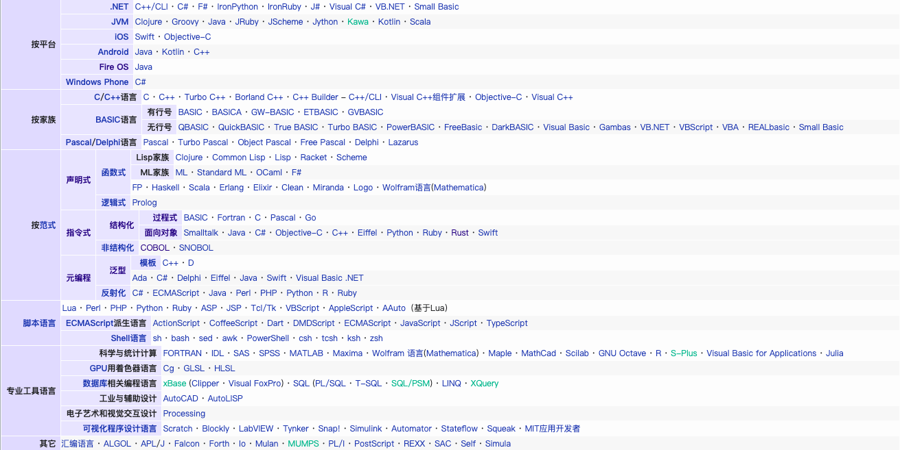
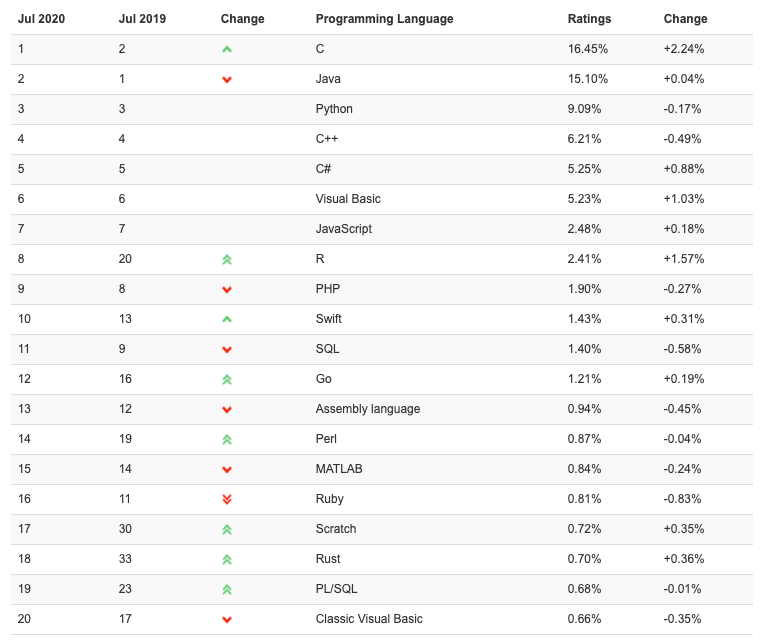
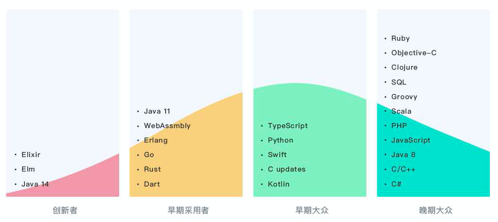

# 编程语言

<nav>
<a href="#编程语言与开发效率">一、编程语言与开发效率</a><br/>
<a href="#编程语言历史与现状">二、编程语言历史与现状</a><br/>
<a href="#现代编程语言高级特性">三、现代编程语言高级特性</a><br/>
&emsp;&emsp;<a href="#变量">变量</a><br/>
&emsp;&emsp;<a href="#代码块">代码块</a><br/>
&emsp;&emsp;<a href="#编程模式">编程模式</a><br/>
&emsp;&emsp;<a href="#内存管理">内存管理</a><br/>
&emsp;&emsp;<a href="#并发">并发</a><br/>
&emsp;&emsp;<a href="#语言处理器">语言处理器</a><br/>
&emsp;&emsp;<a href="#类型系统">类型系统</a><br/>
&emsp;&emsp;<a href="#异常处理">异常处理</a><br/>
&emsp;&emsp;<a href="#其他">其他</a><br/>
</nav>
<br/>

## 编程语言与开发效率

编程语言是影响开发效率最直接的因素，选择适当的语言可以使开发工作事半功倍。编程语言是计算机科学里一门综合的技术，要解决开发效率、性能、安全等一系列元问题，其中开发效率是绝大多数语言追求的核心指标之一。语言的发展呈现出越来越远离晦涩的硬件的趋势，那些对人类更友好简单、能更快开发出功能的高级语言成为主流，一门学习曲线陡峭的语言注定只能是小众的。所以，我把编程语言归入开发效率元问题里进行讨论。

当然，天底之下没有银弹，每种语言都有时代的局限性，也可能为了某些领域而牺牲其他领域的开发效率，比如Rust在安全上的投入，开发阶段的成本会上去，但实际上却显著减少运行阶段由于内存安全引发的修复成本，最终反而提升了整个软件生命周期的开发效率。

## 编程语言历史与现状

最早的编程语言（形式上是一种编码）思想可追溯到[19世纪](https://zh.wikipedia.org/wiki/%E7%A8%8B%E5%BC%8F%E8%AA%9E%E8%A8%80%E6%AD%B7%E5%8F%B2)，比现代计算机还早。自20世纪30年代现代计算机诞生之日起，为了驱动机器，真正意义上的现代编程语言开始被发明出来。

编程语言几十年一路发展过来，从最初极其晦涩的0/1机器码，到更容易被人类记忆但不具备跨机器移植性的汇编，再到以BASIC为代表的逐步具备跨机器移植性的高级语言雏形，接着到以C为代表的主要面向UNIX等系统级软件的高级语言，然后到以Java为代表的面向互联网和企业应用开发并追求安全性和开发效率的工业级语言，（现阶段）最后到以Go为代表的面向多核CPU和云原生的新生代语言。现阶段，非官方统计世界上的编程语言数目在700 ~ 1000种左右，主流的约15 ~ 20种，对它们进行分类是困难的，下图是wikipedia上的编程语言分类表，仅供参考。

<div align="center">
    <a href="../../img/language-classification.png"> </a>
</div>
<br>

编程语言的设计理念突飞猛进，变化飞快，几乎可以每10~15年一个台阶来划分，但所有语言基本上都做到了图灵完备，即理论上可以写出任何算法，因此并没有任何语言是不可取代的。

什么语言最受欢迎？[TIOBE](https://www.tiobe.com/tiobe-index/)给了一些标准，2020年7月榜单见下图，可以看到上世纪90年代是高级语言的黄金时代，89年Python、94年PHP、95年Java和JavaScript、00年C#，这些90后语言占据了当今计算机语言绝对统治地位，70后C语言、80后C++、00后代表Go短时间内根本无法撼动他们。

<div align="center">
    <a href="../../img/tiobe.png"> </a>
</div>
<br>

受欢迎程度仅代表现在，未来谁是王者要看历史机遇和语言自身发展。下图是主流语言现阶段的使用趋势，位于创新者或早期采用者区域的语言，很可能会在未来变到大众区域成为业内最主流，其中Go和Rust值得关注。

<div align="center">
  <a href="../../img/language-trend.png"> </a>
</div>
<br>

## 现代编程语言高级特性

为了适应当前环境、更有效利用现代硬件，各种新语言新高级特性层出不穷，不断为开发者提供更高的开发效率。下面，我们来看看几个关键常见的语言高级特性。

#### 变量
不同语言对变量命名规则要求不同，有些松有些严，比如Java可以随意命名、Ruby规定类名常量名以大写字母开头、PHP用$修饰变量等。松要求可降低新手学习成本，对他们开发效率有帮助，而严要求则增加可读性，有利于控制系统的升级和维护成本，提高后续的开发效率。

#### 代码块
代码块的划分规则会轻微影响到开发效率，使用不当容易导致难以发现的bug。
* 用`{}`圈定一个代码块，以C为代表，是大多数现代语言的选择。该规则往往不强制单语句使用，这经常容易留下bug
* 用缩进来表示，以Python为代表
* 以`end`表示一段代码块的结束，以Ruby为代表

#### 编程模式
编程模式也称为编程范式，可以理解为一种种编程风格，不同编程模式适合不同场景，用对了可大幅提升软件开发效率。大多数语言都支持多模式，有些设计之初就引入多模式，比如Rust一开始就支持面向对象和函数式编程，有些则在不断更新中加入新模式，比如Java 8才引入lambda实现函数式编程。语言支持某种模式，并不意味着开发者能设计出符合该模式的正确程序，比如初学者经常抽象出不合理的对象，导致表面上是面向对象的程序实际退化成了面向过程。

编程模式分为三大类（参见上面的编程语言分类图）：`指令式/命令式`、`声明式`、`元编程`。指令式要求开发者自己编写完成问题的每一步。声明式要求开发者仅编写问题的目标而让语言内部自行完成问题的各个步骤。元编程是用代码生成代码的编程模式，如果所用语言不支持某些喜欢的语法，但该语言支持元编程，开发者就可以造出这些语法，元编程常见的实现手段包括宏、反射等。我们最常用的模式包括面向过程（指令式）、面向对象（指令式）、函数式（声明式）、SQL（声明式）等，下面具体介绍一下。

* 面向过程编程`(Procedure Oriented Programming, POP)`：POP思想是将问题拆解成一个个步骤，每个步骤可以是一段代码、n个函数、n个类，**用步骤来组织程序**。以造房子为例，POP就是依次实现打地基、盖楼、装修等步骤。POP是非常直观的编程模式，大多数语言都支持POP，很多时候我们用其他编程模式设计出POP系统。POP在简单场景下开发效率最高，但在复杂场景下难以设计出扩展性良好和简洁的系统，开发维护成本将变大

* 面向对象编程`(Object Oriented Programming, OOP)`：OOP思想是将问题抽象出所有参与对象，将每个对象所有属性和行为封装在一起，**用对象来组织程序**。仍以造房子为例，我们很容易就能抽象出参与对象是房子，房子对象由属性（门、窗、材料等变量）和行为（打地基、盖楼、装修等方法）组成，初看之下OOP比POP更高级了，但似乎更费心智，岂不是会把开发效率降下来？如果我们把场景弄得复杂一点，假设系统要求适用不同类型的房子，虽然不同房子基本属性和行为是差不多的，但难点在于要低成本适配不同的地方，比如城市一般的商品房需要增加土地购买行为、茅草屋不需要装修、不同房子材料不同等，如果用POP我们只能针对不同房子编写不同程序，而OOP通过继承、多态等设计极容易将程序组织成扩展性非常高的形态，无论增加多少种房子对程序的改造都很小甚至零改造，极大提升开发效率

  * OOP两大实现方式：基于类`(class-based)`和基于原型`(prototype-based)`

    * 基于类型方式以Java为代表，基于原型方式以JS为代表。创建对象时，基于类方式要先定义一个类，再对这个类进行实例化，而基于原型方式是直接创建对象。继承对象时，基于类方式需要另起一个新类继承父类，而基于原型方式直接以某个对象a为原型创建出另一个对象b，实现b继承a。更详细的用例见[这里](https://www.ibm.com/developerworks/cn/web/wa-protoop/index.html)。两种方式各有长短，两个阵营的人要切换到对方都需要换思路，并不容易，基于类方式抽象度更高，学习曲线更陡峭，代码量也可能更多，而基于原型方式更直观更接近人类自然语言，对新手可能更友好

  * OOP三大特征：封装、继承、多态

    * 封装：将一个对象所有属性和行为封装在一起，比如Java的class或者Go的struct。封装实现程序的高内聚低耦合，难点在于是否合理抽象出所有参与对象以及对象属性和行为，这需要开发者有足够的训练量和熟悉业务。接口也是非常重要的封装形式，很多语言采用显式实现接口的风格，比如Java，但也有一些语言采用隐式实现，比如Go中只要实现了某个接口的所有方法就被认为实现了该接口。显式实现接口方式直观易懂，但接口修改后所有实现对象需要随之修改，而隐式实现接口方式没有这个问题，但这种不直观的风格会使阅读和梳理代码时花费更多精力

    * 继承：如果一个对象无法完成所有事情，我们可以实现一个子对象来继承该对象，然后在子对象上进行扩展，这实现了代码的高度复用。继承主要分为单一继承和多重继承。单一继承仅允许继承一个父对象，以Java为代表，这种方式简单不易错但无法复用多个对象代码。多重继承允许继承多个父对象，以C++为代表，可以复用多个对象代码，但多个父对象存在相同方法时会造成二义性，而且实现起来复杂得多，多重继承把所有对象变成有向无环图`(Directed Acyclic Graph, DAG)`，一般用广度优先`(Breadth-First-Search, BFS)`或深度优先`(Depth-First-Search, DFS)`算法搜索，也有某些语言（比如Python等）用`C3`搜索方法。为了弥补单一或多重继承的短板，各语言会做适当的设计，比如Java允许多接口以实现与多重继承相同的效果、Python在多重继承基础上引入[Mix-in机制](https://zhuanlan.zhihu.com/p/138046102)。Go提供了另一种代码复用风格，被复用的对象以匿名成员的方式（无需给成员命名）集成进目标对象，这实际是一种组合，取代了传统的继承实现复用，是践行`组合优于继承`的一种设计

    * 多态：如果一个对象拥有多种形态，利用多态设计将多种形态统一关联起来，不需要为每种形态单独编写对象。多态分为动态多态和静态多态，也称为运行期多态和编译期多态，区别在于是在运行期还是编译期确定使用对象的哪个形态。多态的常见运用是方法重载和重写，以Java为例，重载方法和static同名方法的调用在编译期可以确定使用哪个类和方法，属于静态多态，而非static重写方法的调用要到类加载期或运行期才能确定，属于动态多态。还有一种很重要的多态运用，将参数的类型泛化实现多态，称为`泛型`，举个例子，定义一个泛型方法`func(<T> a)`，T表示可以赋予不同类型，我们可以这么使用该方法`func(123)`或`func("abc")`。一般泛型属于静态多态，以Java为例，能在编译期使用类型擦除技术将`<T>`替换成具体的类型

* 函数式编程`(Functional Programming, FP)`：FP的理论基础是λ演算`(lambda calculus)`，主张将问题看成是一段段数据的转化过程（想想图灵机），把每个转化过程封装成一个个函数，**用函数来组织程序**。其他模式也能提供函数，那FP有何不同？我总结起来核心有两点：函数数据化、数据不可变性。这个归纳可能与一般的观点不太一样，后面再详说。理论上FP可以用在任何应用场景，不过数学计算场景更直观，所以这里举个数学计算例子，即输入一个整型数组，对该数组每个元素乘以2进行输出，非FP语言会用循环或迭代，而FP代码可以写成`numbers.map(x=>x*2)`，用非常简洁的的匿名函数  `x=>x*2`就表达了同样的语义。该例子里，FP代码无需关注遍历顺序、是否并发等问题，而非FP代码需要，这说明用FP能写出完全专注于做什么的代码（即乘以2），而不用关心怎么做（比如使用循环还是其他方式遍历数组），这种风格更接近自然语言，对编程新手更友好，这也正是FP优势之一：可写出更简洁、更灵活、更紧凑风格的代码，大大提升软件的开发维护效率

  * 函数数据化：函数被当成数据的一种，可以赋给变量、可作为入参传递、可作为出参返回。该思想衍生出以下设计

    * 支持高阶函数：参数为函数或返回值为函数的函数

    * [函数的合并和柯里化](https://ruanyifeng.com/blog/2017/02/fp-tutorial.html)：支持将多个函数合并以及多参数转单参数

    * 闭包：这是一种可以使用其他函数数据的函数。假设一个函数a定义在另一个函数b的作用域中，a称为内部函数，b称为外部函数，如果a引用了b的局部变量，那么a就是一个闭包。当b返回后，a依然可以使用b的变量

  * 数据不可变性：数据允许传递但不允许修改，加上引用透明，FP可以做到高度冥等性，即相同输入总会产生相同的输出。这个设计看起来违反了冯诺依曼体系架构倡导的通过修改存储器里的值去影响后续计算，而实际上FP的底层理论λ演算在上世纪30年代就已早于冯诺依曼体系提出，为了在当前普遍采用该体系的计算机上运行，FP语言都会被编译成符合冯诺依曼机器的指令。该思想衍生出以下设计

    * 引用透明：函数只依赖入参不依赖于任何外部变量。非FP语言存在全局变量，无法实现引用透明

    * 尾递归：指递归调用是整个函数最后执行的语句。由于数据的不可变性，所以FP不使用for/while，因为循环语句会依赖可变状态变量来控制循环，FP只能选择递归，但频繁的递归会使栈内存使用大增。尾递归可以优化这种情况，由于尾递归的最后执行语句也是方法本身，整个过程只需要一个栈桢存储即可，最底层方法执行前，栈桢保存的是最底层方法的参数和返回值，每执行一层，该栈桢就是该层方法的参数和返回值，这种只用一个栈桢来保存整个递归过程也叫栈重用，极大节省了栈的内存开销

    * 严格遵循数据不可变性往往显得“异类”，导致学习曲线变陡（但实际更接近自然语言），只有少量纯FP语言（比如Haskell）存在，大多数支持FP的语言都会做权衡，比如Java的lambda里可以使用循环

    * 数据不可变性避免了共享数据的所有并发问题，没有锁还可有效利用多核，性能上会有很大提升

> 函数响应式`(Functional Reactive Programming, FRP)`：可以看成FP的一种演化版，同样是简化数据的转化过程，更进一步加入了观察者模式，将观察数据和被观察数据绑定在一起，被观察数据一旦改变，观察数据可随之改变。FRP代表有Java的RxJava框架。下面的伪码直观体现了FRP的用途

```
// a = b + c
a = func(i, j) {return i + j};
b = 1;
c = 2;
a.bindTo(b, c); // 将a和b、c绑定，a是观察者，b和c是被观察者
a();  // 输出3
b = 3;
c = 4;
a();  // 输出7
```

#### 内存管理
内存是软件不可或缺的资源，用好语言限定范围下的内存是影响开发效率的重要因素。语言对内存管理分为非托管和托管。非托管型语言以C/C++为代表，允许应用自行创建、操作、销毁任意可用范围内的内存，这种设计授予开发者充分灵活性的同时也带来各种使用内存不当问题。托管型语言以Java/Python为代表，应用对内存的使用受到语言内部（比如JVM）的严格监管，这种设计保证了内存安全的同时也可能带来性能开销。不过很多语言并非严格地遵循非托管或托管，比如Java提供了unsafe接口放开对内存的操作。在此基础上，内存管理衍生出了许多设计。

* 指针：指针一开始是为避免低级语言直接访问物理内存而诞生的，它可以指向一个变量、对象或函数的地址，通过它可以更安全更方便地管理内存。指针对开发者要求较高，一不小心就容易写出带有内存重叠、溢出等问题的代码。正因如此，后来很多语言直接放弃了指针（比如Java），或者对指针的使用做了较多限制（比如Go禁止对指针++）

* 垃圾回收`(Garbage Collection, GC)`：GC是语言中自动回收无用内存和整理有用内存的技术，一般来说只有托管型语言才有。GC分为垃圾采集和清除两个步骤

  * 垃圾采集：主要有引用计数和跟踪采集两种算法。引用计数记录了所有对象被引用的数目，当引用数为0时意味着该对象不再被使用，后续应该被回收，但此算法无法解决循环引用问题，比如a和b相互引用，那么它们的引用次数就永远不会为0，将永远无法被回收。跟踪采集规定了一些根对象，比如静态变量或常量等，这些根对象不会被回收，如果一个对象被根对象直接或间接引用，视为可达，不会被回收，否则将被回收。引用计数的采用者包括Objective-C、Rust（仅智能指针）等，跟踪采集的采用者包括Java、Go等

  * 垃圾清除：主要算法包括清除、压缩、复制。清除算法将死亡对象所在内存直接标记为空闲，并维护一个空闲链表，优点是快，缺点是内存碎片。压缩算法将所有存活对象压缩到一起，优点是没有内存碎片节省空间，缺点是开销较大。复制算法将存活对象copy到另一个空间，并压缩放一起，优点是没有内存碎片，缺点是需要一个额外等大空间，相当于可用空间减半。各大语言采用不同算法，Java不同GC器用了不同算法，而Go采用清除算法

* 内存安全：2019年初在以色列举行的BlueHat会议上，微软安全工程师指出过去12年里，微软70%安全漏洞来自于内存安全。从一个侧面可以推断，内存的安全使用深远影响到软件的开发维护成本，进而关系到软件的开发维护效率。上面提到的指针解决了低级语言直接操作物理内存引发的安全问题，而指针存在的安全隐患又导致不少语言抛弃了它，但这仍不够，就像我们在用Java编写程序时仍然遇到内存泄漏和线程安全问题。Rust提供了全新的内存安全思路，在语法层面设计了许多强制的安全限制（比如所有权和借用），并在编译器上加入了严格的安全检查。举一个例子，先初始化一个变量x，接着将x赋值给y，这会导致x的所有权交给y，如果发生delete x会在编译期报错，这样的好处很明显，绝对不会发生因为删了x而导致y被误删，严格地保证了内存安全。可以认为，Rust用新人学习成本和编译性能换取了安全和代码质量，进而无形中减少了维护成本提高开发效率，很可能是一笔划算的买卖

#### 并发
并发主要影响到性能元问题，但也关系到开发效率元问题。随着电路密集度和热密度接近极限，单个CPU核心性能已无法获得提升，而使用多个CPU核心就成了当前主流也是唯一的提升机器性能的方法。硬件层面的改变会影响到软件设计，为了尽最大可能利用所有核心，软件就要并行启动多个分身去分别使用不同核心。“分身”可以通过多进程、多线程、多协程等方式实现。如果语言提供了简洁安全的“分身”语法，开发者就能在充分驱动多核获取高性能和避免并发问题的同时保证开发效率，反之则开发者要牺牲开发效率来保证性能和避免并发问题。

* 多进程：多进程的最大优点是隔离性好，一个进程崩溃不会影响其他进程，但其缺点是开销大，包括创建、内存占用、进程间数据共享等方面都有不小的开销。几乎所有高级语言都支持多进程的创建和管理，只是友好程度不一

* 多线程：线程相较进程来说各方面开销小很多。如果你喜欢多线程，可以使用以Java为代表的推崇多线程的语言。一直以来，语言层面提供的多线程能力不能避免原子性、锁等并发问题，完全要依赖开发者的能力，而Rust强制安全的设计保证了默认线程安全，似乎会成为趋势

* 多协程：协程比线程更进一步轻量。单个协程初始内存(2KB)小于线程(1MB)。协程的最大数量不受OS限制，而进程和线程都有数量上限，意味着在极端高并发场景下协程更容易接收和维护更多请求。协程调度器在应用态，而进程和线程的调度切换要陷入OS`(Operating System)`内核态，调度开销更小，这一点在我的文章[《浅谈Go语言》](https://github.com/star2478/golang-wiki/wiki/%E6%B5%85%E8%B0%88Go%E8%AF%AD%E8%A8%80)中有所介绍。值得一提的是，多进程多线程语言中经常采用共享内存方式来传递数据，为了保证共享内存的并发访问往往要增加锁开销，而Go采用了一种Channel消息传递机制——当一个协程完成某个共享数据的访问后将异步唤醒另一个协程去访问，可避免锁开销

#### 语言处理器
软件要能运行，必须要转化成CPU平台能够识别的机器码（0/1组成），根据转成机器码和运行机器码的方式和时机将语言分为`编译型`和`解释型`。编译型语言以C为代表，先将源码通过编译器转成机器码再运行，转码和运行两步分开，其优点是由于事先已转成机器码所以运行速度快，缺点是运行前需要对整个源码进行编译转码，会导致开发调试的效率变低。解释型语言以Python为代表，通过解释器对源码逐条解释成机器码并直接运行，转码和运行合并在一起，其优点是运行时是逐条源码解释，能很快看到代码的运行结果，开发调试效率高，缺点是运行速度相对较慢。

> 更进一步，编译还分为静态编译和动态编译，前者在编译时将依赖库链接到机器码文件中，可以使运行速度更快，而后者编译时不链接依赖库，可以使编译速度更快和机器码文件更小。不同语言对编译类型的默认选择是不同的，像C这种较老的语言诞生在内存紧缺的时代，所以它选择默认是动态编译，这样编译时可以尽可能用更少的内存，而Go诞生时内存已足够大，所以选择默认是静态编译

除了编译型和解释型，还有一种重要的类型，即以Java为代表的`混合型`或`半编译型`，先用编译器转成特殊的中间码（比如Java称之为字节码），再用虚拟机对中间码逐条解释运行。这种专属于语言的虚拟机有别于传统系统级虚拟机，语言虚拟机也称为进程虚拟机。虚拟机一般基于栈或寄存器实现，两种方案优劣并无定论，不同语言会采用不同方案，甚至同一个语言采用不同方案，比如Java Hotspot虚拟机（用于服务端）是基于栈的，而Java Dalvik虚拟机（用于Android）是基于寄存器的。中间码指令长度也可能采用不同方案，一般是8位和32位，前者内存使用率更高，后者性能更高（CPU 32位对齐所以取指令快）。从开发效率角度来看，混合型语言的优点是同一份编译好的中间码可以移植到任意CPU平台运行（当然前提是有该平台的虚拟机且安装了），降低了移植成本，缺点是存在编译环节，开发调试的效率相对较慢。

事实上，各个语言的类型界限早已模糊。比如，Java等大批语言引入了JIT`(Just In Time)`技术，将中间码中的热点代码直接编译成机器码缓存起来以加速后续的运行速度，相当于在“混合型”上杂糅了“编译型”的设计。又比如，Python可以直接解释源代码运行，也可以编译为中间码通过虚拟机运行。

#### 类型系统
类型系统是编程语言的基础，其决定了程序中所有数据的类型，比如整数、浮点数还是字符。开发中处处受到类型系统的约束，对开发效率有重要影响，尤其对于新手，为了某些特性主动或被动选择了一门语言，但往往忽略其类型系统，很容易在实践中踩到坑。

程序错误分为`trapped error`和`untrapped error`，前者发生时会使程序终止运行，比如除零、数组越界等，后者发生时不会使程序终止运行。

按照类型相关untrapped error的检查时机，将语言分为`静态型`和`动态型`。静态型语言指在编译时可检查出类型相关untrapped error的语言，代表包括C/C++/Java/Go等，比如Java中定义`String a="1"`和`int b=1`，则`a/b`在编译时会报操作数类型错误。动态型语言指在运行时才检查类型相关untrapped error的语言，代表包括Python/PHP/JS等。可以想见，静态型在编译期做了检查，运行时会更快，而动态型给予开发者更灵活的空间，比如同一个变量可以适配不同类型，减少代码量，码写得飞快，但对老系统进行升级重构时却要谨慎地推断各种变量上所用类型，一不小心就会踩坑，正所谓“动态一时爽，重构火葬场”。

> 经常有两个误解：一是将静态型、动态型分别与编译型、解释型等价起来，实际并非如此，虽然常用语言中确实大部分编译型语言是静态型的，同时大部分解释型语言是动态型的；二是将是否显式指定变量类型来划分静态型和动态型，但实际上动态型语言在运行时才进行类型推导，所以它们不需要显式指定，但静态型语言也可以不指定，编译器可以做推导——静态型可分为`显式静态`和`隐式静态`，前者需要指定变量类型而后者不需要，像C或Java定义变量时要加上类型（例如int a），属于显式静态，而Go或Haskell无需加类型（例如var a），属于隐式静态

此外，还可按照运行时是否存在类型相关untrapped error，将语言分为`强类型`和`弱类型`。强类型语言指在运行时不会发生类型相关untrapped error的语言，代表包括Java/Python/Go等，比如Python中`'123'/123`会在运行时报TypeError错误。弱类型语言指在运行时会发生类型相关untrapped error的语言，代表包括C/C++/JS等，比如C中越界数组访问不会报错。

一门语言在不断发展过程中，出于兼容性和用户习惯等原因，类型系统在大方向上一般不会做改变，但小优化还是会随着时代的需要而发生。比如Python 2中字符串是一组字节，因为其诞生在需要大量脚本开发的系统级软件喷发的时代，此时要适应以字节为单位的操作系统、管道、网络socket等场景。而到了Python 3，字符串变成了一组Unicode码，因为其诞生在Web时代，网络交互普遍以Unicode码为基础。

#### 异常处理
程序发生异常后的处理机制是每个高级语言的一项重要设计，简洁的处理机制能让处理异常的代码减少，提升软件整体的开发效率。

一种异常处理机制是返回值中带上错误对象，调用者通过错误对象判断是否异常。对于这种机制，大多数语言都需要开发者自行设计错误对象。Go提供了内置的Error对象，且支持多参数返回，函数的最后一个参数可以是Error对象，这样就从语言层面支持这种异常处理机制了，无需开发者自行设计。

另一种普遍的异常处理机制是异常捕获，在程序发生异常处抛出异常，在某处捕获异常并进行处理，比如Java的`try-catch-finally`。这种机制会改变程序的控制流，使用不当容易出错，有些语言选择了谨慎使用，比如Go也提供了类似的`defer-panic-recover`，一般是由系统自动抛出的严重异常，当然，用户也可以使用panic(“xxxx”)主动抛出。这种机制放开了对异常的定义，要求开发者要尽可能对所有可能发生异常的地方加上捕获，这无疑加大了开发者的开发成本，为此Java将异常分为受检和非受检，当开发者使用了可能会引发受检异常的语句时（比如进行I/O），会强制要求加上捕获，否则编译不通过，从语言层面提醒开发者做异常处理（释放I/O），减少开发成本。

资源使用完未释放经常是造成系统异常的一大因素，为此各个语言想方设法让开发者尽可能记住释放资源。`finally`是普遍的做法，在`finally()`实现资源释放，当函数正常或异常返回时`finally()`会被自动执行，保证了资源的释放。但`finally`会让代码量增加，在`finally()`里资源释放失败也得捕获。Java 7提供的`try-with-resource`机制值得学习，资源类事先实现`AutoClosable`接口重写资源释放方法`close()`，资源使用时在`try()`中写上所有资源open语句，这个机制只需要写`try-catch`，不需要写`finally`，因为编译器会自动编译出`finally()`，里面调用了`try()`里定义的所有资源的`close()`。此外，Go提供的`defer`，不像`finally()`那样要放在函数后面，`defer()`可以放在资源打开后的任意地方，比如open下一行马上就加defer close，这样既容易记住要close，又能极大避免把close写得到处都是导致重复close。

#### 其他

* 语言交互接口`(Foreign Function Interface, FFI)`：这是一门语言能与其它语言实现的接口进行交互的能力。大多数语言都有FFI，比如Java和Go都可以直接调用C代码

* 参数：多数语言都有函数参数的扩展性设计，比如Java支持可变长入参（用`...`表示），Go支持函数返回多个出参（用逗号隔开）
